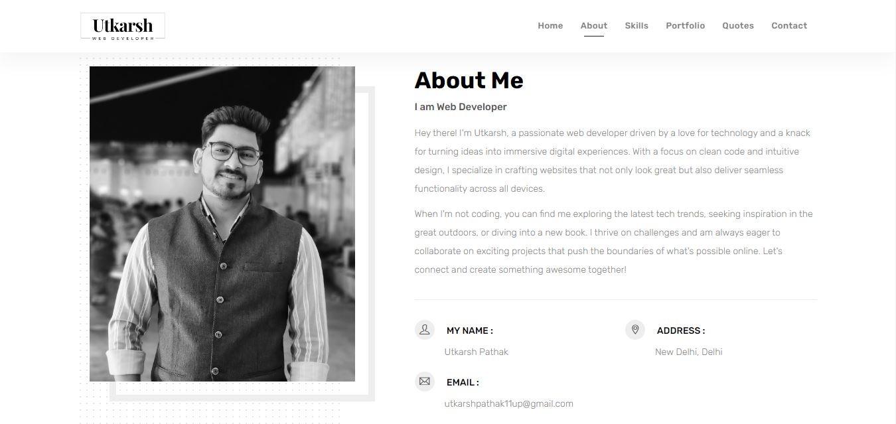
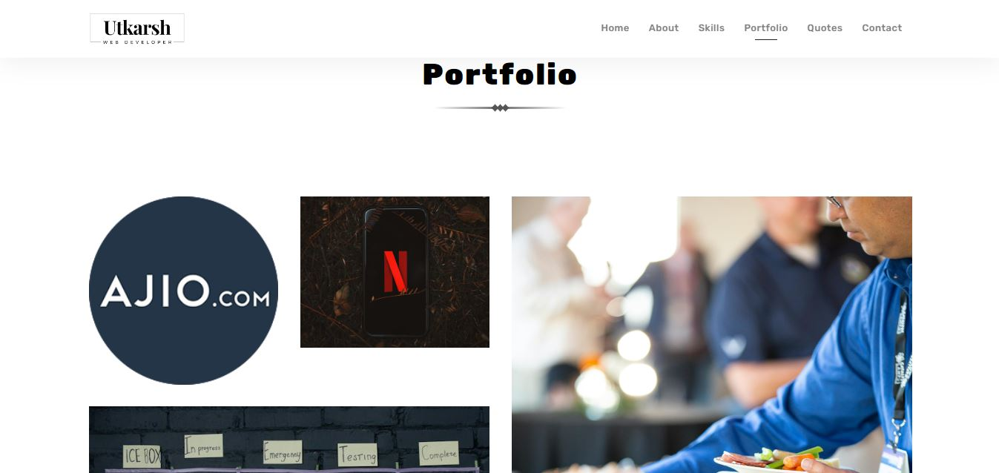

  

# Portfolio Website

Welcome to my personal portfolio website!

## Technologies Used
This website is built using the following technologies:

HTML: Used for structuring the web pages.           
CSS: Employed for styling and enhancing the visual appeal.                                      
JavaScript: Implemented for dynamic functionalities and interactivity.

## Badges
Add badges from somewhere like: [shields.io](https://shields.io/)

## ScreenShots

